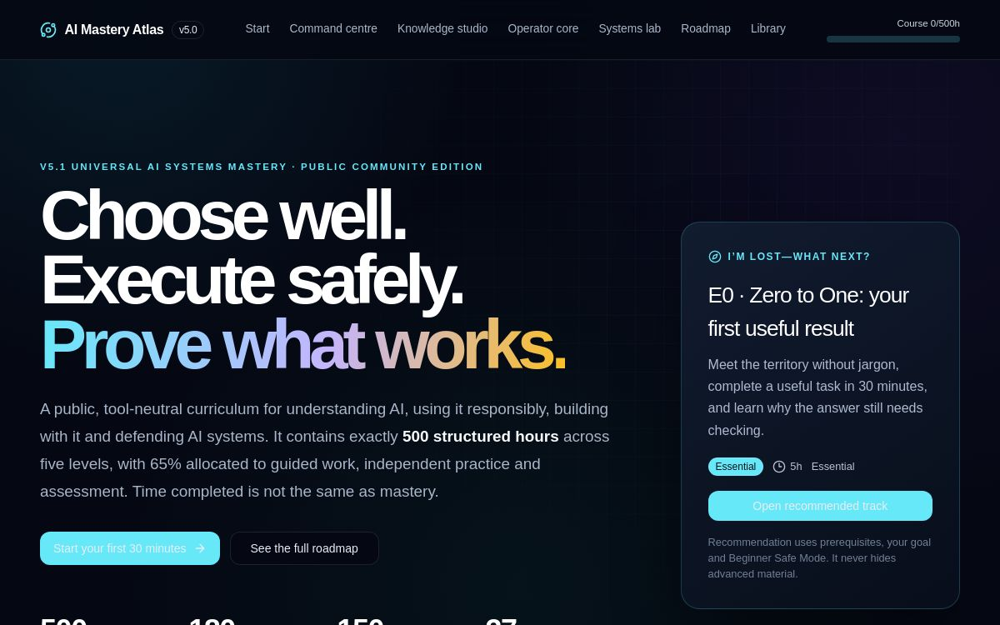

# AI Mastery Atlas

An evidence-driven curriculum and practice system for learning modern AI tools—from foundations and prompting to evaluation, coding agents, retrieval, knowledge systems, and defensive security.

[**Open the live Atlas**](https://ai-mastery-atlas.phenlleyniron.chatgpt.site/) · React · TypeScript · Vinext · Cloudflare Workers · browser-local learning state



## What it includes

- Structured beginner-to-mastery curriculum with explicit outcomes
- Practical pathways for ChatGPT, Codex, Gemini, Claude, NotebookLM, Cursor, and related tools
- Evidence stages, transfer tasks, delayed retests, and a browser-local skills passport
- Source-quality labels and first-party reference shelves
- Labs for AI economics, retrieval, evaluation, knowledge systems, and defensive security
- Privacy, integrity, accessibility, and UI contracts tested in the repository

Progress is stored locally in the browser. The public site does not require an account and does not treat time spent as proof of mastery.

## Run locally

Requirements: Node.js 22.13+ and Linux with `flock`, `curl`, and GNU `timeout`.

```bash
npm run install:ci
npm run dev
```

```bash
npm test
npm run lint
```

`npm test` builds the project and runs integrity, accessibility, privacy, and UI contract checks.

## Project map

- `app/` — entry points and global styles
- `components/` — curriculum, labs, mastery tracks, and reusable UI
- `lib/` — programme data, learning state, competency graph, and tool-specific tracks
- `tests/` — behavioural and rendered-output contracts
- `worker/` — Cloudflare Worker entry point

## Status

This GitHub import preserves the source behind the public ChatGPT Site. Product availability, pricing, and model specifications change; volatile claims should always be checked against the linked first-party sources.

No licence has been granted yet. The source is public for inspection; reuse rights remain reserved unless a licence is added.
